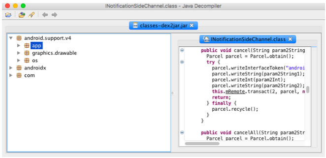

# transfer-apk-file-to-source-code


For decoding .apk files, there are some steps as you can see in [stackoverflow](https://stackoverflow.com/questions/3593420/is-there-a-way-to-get-the-source-code-from-an-apk-file):
#### Step 1:
Create a folder with your .apk file inside it. Then change the .apk file to .zip by renaming from filename.apk to filename.zip. By extracting the zip file, you see the classes.dex files, etc. At this step you can see drawables but not xml and java files.

#### Step 2:
Download [dex2jar](https://github.com/pxb1988/dex2jar) and extract it to the your folder. 
Move the classes.dex file into the dex2jar folder.
<p align="center">

</p>

##### if you are on windows
Open command prompt. Then change directory to dex2jar folder and write ```d2j-dex2jar classes.dex```. Now you have the    classes.dex.dex2jar file in the dex2jar folder.
##### if you are on linux/mac:
Open terminal. Then change directory to dex2jar folder and write ```./d2j-dex2jar.sh classes.dex```. Now you have the classes.dex.dex2jar file in the dex2jar folder.
<p align="center">

</p>

Download [java decompiler](http://java-decompiler.github.io). Open classes.dex.dex2jar file from that folder. Now you get class files.
Save all of these class files by clicking File and then Save All Sources with "src" name. At this step you have the java source.

<p align="center">

</p>


#### Step 3:
This step make .xml files readable.
Create a new folder. Copy over your .apk file.
Download the latest version of [apktool](https://ibotpeaches.github.io/Apktool/install/) and [apktool install window](https://ibotpeaches.github.io/Apktool/install/).
Open a terminal/command prompt. Write ```apktool d your_apk_filename.apk``` (where your_apk_filename.apk is the apk file that you want to decode it)


